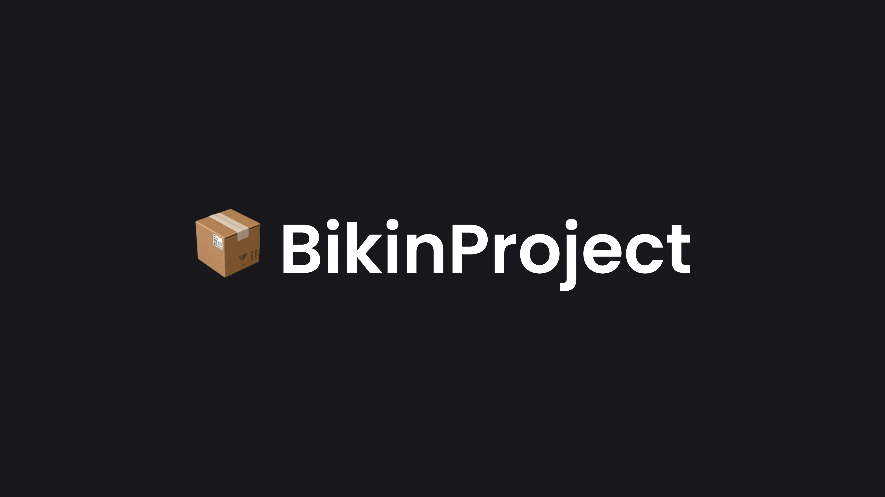

# BikinProject Documentation Website



BikinProject is a starter project generator package that makes it easier for you when you want to create a project. The starter project provided is a custom starter project that has been designed in such a way that it can be easily used. Starter projects are available with various frameworks and programming languages.

This is a [Next.js](https://nextjs.org/) project bootstrapped with [`docs-template`](https://github.com/nisabmohd/Documentation-Template).

## Getting Started

You can use this package by running the following command in your `terminal`:

```bash
npx bikinproject@latest
```

Then you can answer some questions asked by package `BikinProject`:

```bash
┌   create-bikinproject-app
│
◇  Where should we create your project?
│  ./your-project
│
◇  Pick a project type within "./your-project"
│  Next.js App Router (Tailwind + TypeScript)
│
◇  Install dependencies?
│  No
│
◇  ⏳ Creating project...
│
◇  🎉 Project Created!
│
◇  Next steps. ───────────────╮
│                             │
│  cd ./your-project          │
│  npm install                │
│  npm run dev                │
│                             │
├─────────────────────────────╯
│
└  Have a Problems? Report to https://github.com/nuflakbrr/bikinproject/issues
```

## Framework List

### Frontend

- Next.js App Router (Tailwind + TypeScript)
- Next.js App Router (Tailwind + JavaScript) 🚧

### Backend

- Node.js 🚧

### Fullstack

- 🚧

## How to Contribute

For a complete guide on how to contribute to this project, please open the [CONTRIBUTING.md](https://github.com/nuflakbrr/bikinproject/blob/main/CONTRIBUTING.md) file.

## License

This work is licensed under the [MIT LICENSE](./LICENSE).

## Author

Author name and contact info,

Naufal Akbar Nugroho

[Website](https://nuflakbrr.vercel.app)
[@nuflakbrr](https://github.com/nuflakbrr)
[@kbrnugroho](https://instagram.com/kbrnugroho)
